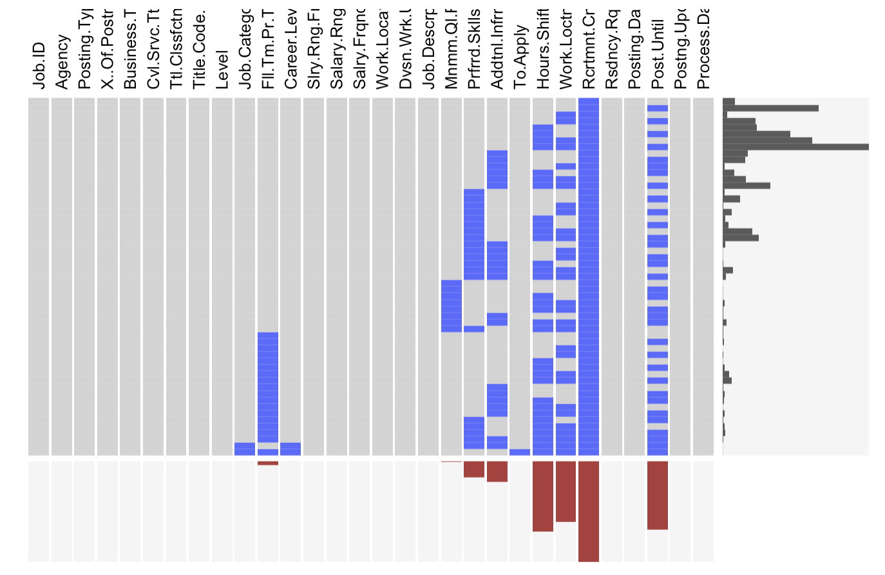
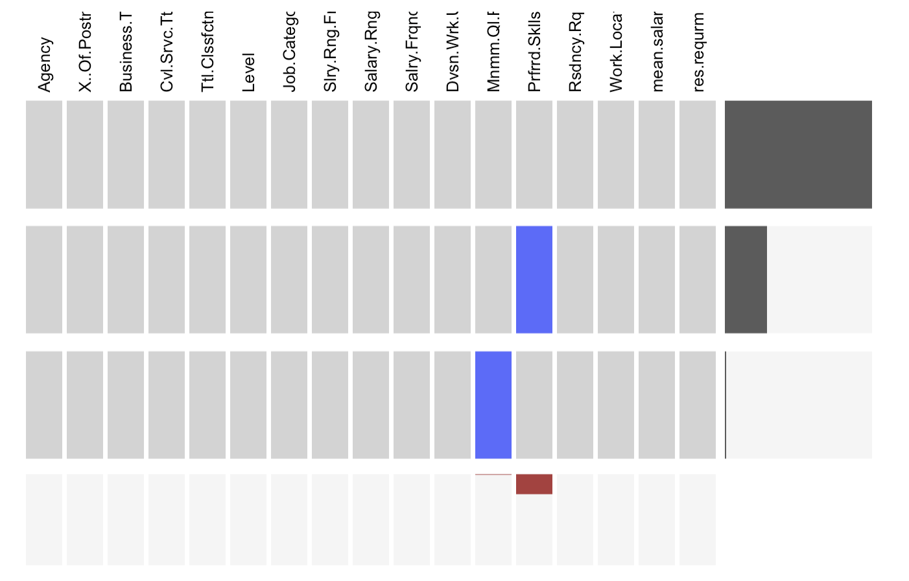
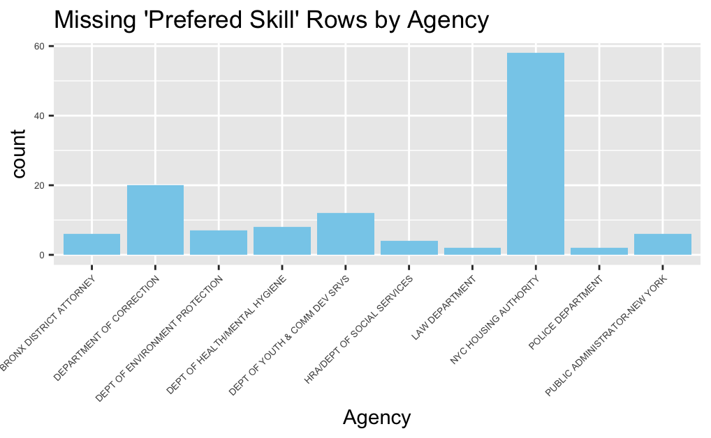

# Data 

## Sources

  The source of the data we use is the NYC Open Data (https://opendata.cityofnewyork.us). The data set NYC Jobs (https://data.cityofnewyork.us/City-Government/NYC-Jobs/kpav-sd4t) contains current job postings available on the City of New York’s official jobs site (http://www.nyc.gov/html/careers/html/search/search.shtml). The data is collected by NYC Open Data and provided by Department of Citywide Administrative Services (DCAS). We choose this dataset because it is provided directly from a government agency and has high credibility. It also has the detailed and most updated list of NYC government jobs, so it is a suitable dataset for our research.
  
  The dataset has 5421 observations, each of which is a job posting. It has 30 columns. Among them, 3 columns are date&time variables, 4 columns are continuous variables and 23 are plain text variables. Each column of this dataset contains information or requirement of this job posting.
  
  Although the dataset is mostly clean, there is still problem with it. Since the jobs are posted by different agencies, the formats of some columns are not uniform, especially for those that have long sentences such as **preferred skill**, so we will spend extra time to transform these data.

## Cleaning / transformation

  Since there are 30 columns in this dataset, we need to first remove the columns with no pivotal information such as **Title.Code.No**. The remaining columns are the 16 columns below:

 [1] "Agency"                        "X..Of.Positions"              
 [3] "Business.Title"                "Civil.Service.Title"          
 [5] "Title.Classification"          "Level"                        
 [7] "Job.Category"                  "Full.Time.Part.Time.indicator"
 [9] "Career.Level"                  "Salary.Range.From"            
 [11] "Salary.Range.To"               "Salary.Frequency"             
 [13] "Division.Work.Unit"            "Minimum.Qual.Requirements"    
 [15] "Preferred.Skills"              "Residency.Requirement"
 [17] "Work.Location"

  Besides, since we are particularly interested in the full-time jobs for entry level, we will only select rows of full time entry-level jobs. Now our dataset only have 511 rows, and we will drop the **Career.Level** and **Full.Time.Part.Time.indicator** columns.
  
  In the data transformation step, to have a better idea of the salary of each job, we add a new column 'Mean.Salary' by calculating the mean of **Salary.Range.From** and **Salary.Range.To**.
  
  We also transformed the **Job.Category**,**Minimum.Qual.Requirements**, **Preferred.Skills** variables to make them eaiser to analyze.
  
  
## Missing value analysis
There are empty strings in this dataset that are missing values. To address them, we fill the empty strings with NAs. 
We use extracat::visna to visualize the missing values for each column in this dataset.

There are 10 columns contain missing values. We would only focus on the 16 columns that contain pivotal information, so we further visualize missing values on these selected columns.

The only columns that contain missing values here are **Minimum Qual Requirements** and **Preferred Skills**. Since these two columns may relate to the salaries of jobs which is of our interests, we keep them for future study and use NA to indicate missing values instead of dropping the two columns.

Observed that **Preferred Skills** has the most missing values, we would like to see whether the missing condition of preferred skills has something to do with agencies of jobs. Below, we count the number of missing values of **Preferred Skills** by **Agency** and visualize it with a bar plot. 

"NYC Housing Authority" has the most missing values for **Preferred Skills**. This is informative as housing authority might not need specific skills due to its job nature，so the values for "Preferred Skills" tend to be missing on job postings.
