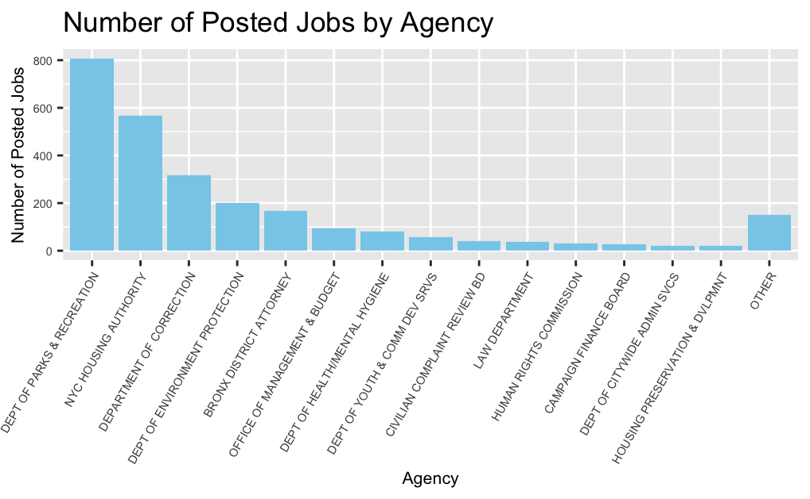
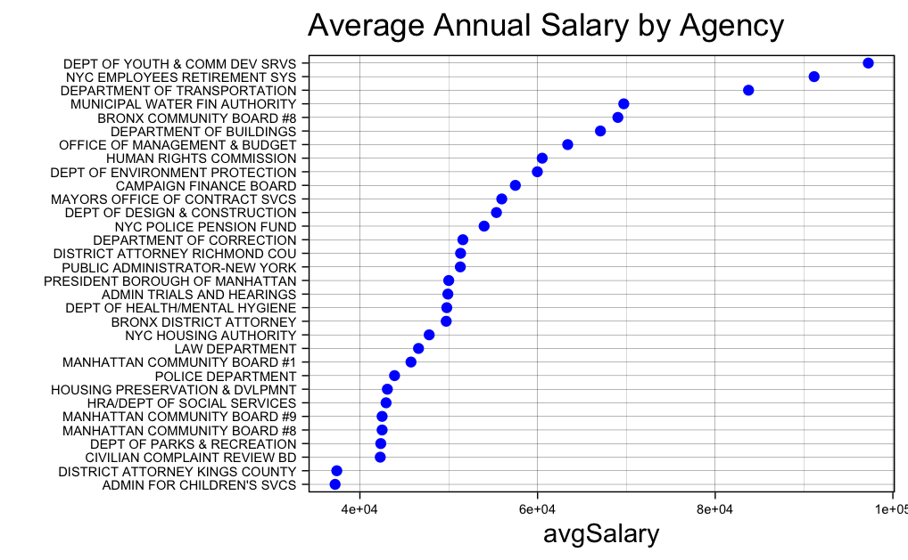
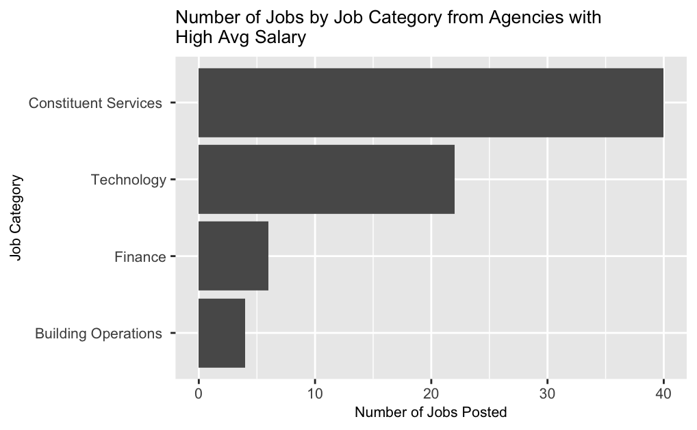
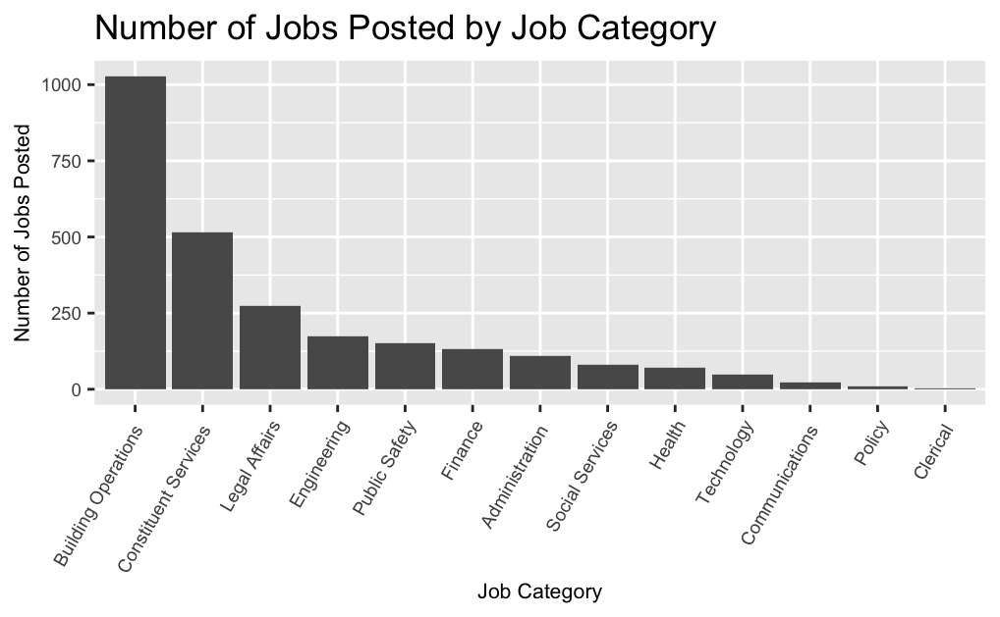
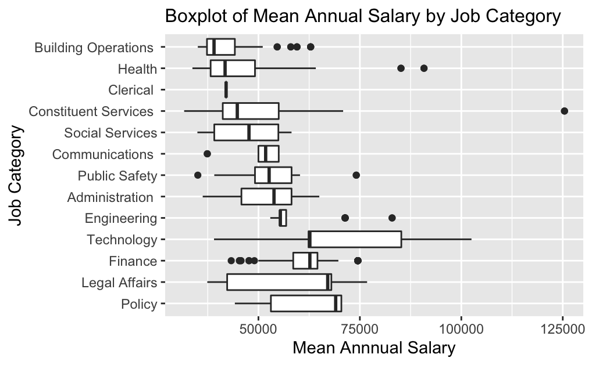
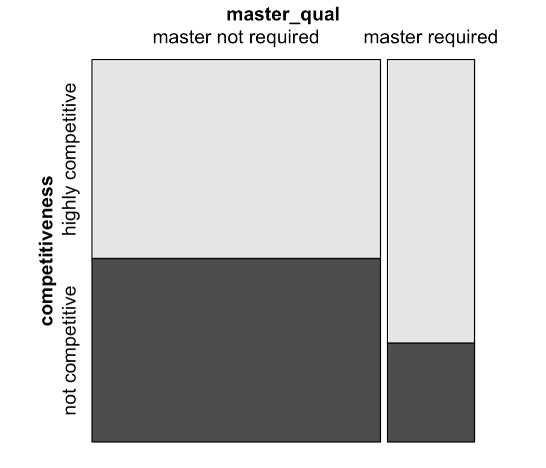

# Results

## Job Conditions Analysis by Agency

In this part, we will analyze the entry-level government jobs by Agency. In particular, we will analyze the number of jobs as well as the annual salary of these jobs.

First, we use bar chart to visualize the number of positions posted by each Agency. Since some of the agencies posted very few jobs, we put agencies posted less than 20 jobs into a category "OTHER".

From the plot above, we can see that the Agency that posted the most jobs are **DEPT OF PARKS & RECREATION** and **NYC HOUSING AUTHORITY**. It may be explained by the reason that there are lots of parks and recreation facilities in NYC, they need many people to maintain and manage these facilities. Besides, and due to the large population of NYC and increasing immigrants, housing authority has a larger demand for employees.

Besides, we use cleveland dot plot to visualize the average salary of each agency.

From the plot above, we can see that **DEPT OF YOUTH & COMM DEV SRVS**, **NYC EMPLOYEES RETIREMENT SYS** and **DEPARTMENT OF TRANSPORTATION** has average salary much higher than other agencies. To have a better idea of the reason behind this finding, we will further analyze these agencies' job category.

From the graph above, we can see that the jobs posted by **DEPT OF YOUTH & COMM DEV SRVS**, **NYC EMPLOYEES RETIREMENT SYS** and **DEPARTMENT OF TRANSPORTATION** are all in four categories, in which most of them are in constituent service and technology categories. This finding can partly explained the high average salary for these three agencies since these kinds of jobs have high requirements and ususally have higher salary.

## Job Conditions Analysis by Job Category

In this part, we will analyze the entry-level government jobs by Job Category. In particular, we will analyze the number of jobs as well as the annual salary of these jobs.

## Jobs Competitiveness and Qualifications Analysis

In this part, we will analyze the minimum qualification requirements of jobs and further study if it has an association with job competitiveness.

After data cleaning on *Minimum.Qual.Requirements* column, we observe that the highest-standard minimum qualification requirement is Master's Degree. As Master students, we would like to see whether jobs that require a minimum qualification of a Master's Degree are more competitive. The competitiveness of jobs are indicated in the column *Title.Classification*. We did some data cleaning and categorized the competitiveness of jobs into 'highly competitive' and 'not highly competitive'. 

To better visualize the association between minimum qualification requirement and job competitiveness, we plot a mosaic plot as below.

