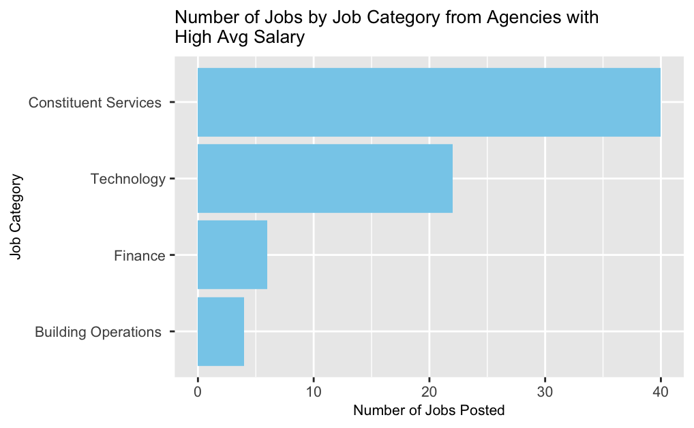

# Results
(All the codes in this section are in the file dataclean&EDA.Rmd)
## Job Conditions Analysis by Agency

In this part, we will analyze the entry-level government jobs by Agency. In particular, we will analyze the number of jobs as well as the annual salary of these jobs.

First, we use bar chart to visualize the number of positions posted by each Agency. Since some of the agencies posted very few jobs, we put agencies posted less than 20 jobs into a category "OTHER".

From the plot above, we can see that the Agency that posted the most jobs are **DEPT OF PARKS & RECREATION** and **NYC HOUSING AUTHORITY**. It may be explained by the reason that there are lots of parks and recreation facilities in NYC, they need many people to maintain and manage these facilities. Besides, and due to the large population of NYC and increasing immigrants, housing authority has a larger demand for employees.

Besides, we use cleveland dot plot to visualize the average salary of each agency. For easier comparision, we filtered the jobs with Annual Payment method.

From the plot above, we can see that **DEPT OF YOUTH & COMM DEV SRVS**, **NYC EMPLOYEES RETIREMENT SYS** and **DEPARTMENT OF TRANSPORTATION** has average salary much higher than other agencies. To have a better idea of the reason behind this finding, we will further analyze these agencies' job category.

From the graph above, we can see that the entry-level jobs posted by **DEPT OF YOUTH & COMM DEV SRVS**, **NYC EMPLOYEES RETIREMENT SYS** and **DEPARTMENT OF TRANSPORTATION** are all in four categories, in which most of them are in constituent service and technology categories. This finding can partly explained the high average salary for these three agencies since these kinds of positions have higher requirements for employees and usually have higher salary.

## Job Conditions Analysis by Job Category

In this part, we will analyze the entry-level government jobs by Job Category. In particular, we will analyze the number of jobs as well as the average annual salary of these jobs.

From the above bar plot, **Building Operations** category has the greatest number of entry-level job postings, followed by **Constituent Services**, and **Clerical** category has the least number of job postings. The divergence on number of job postings may serve as an indication of the demands of labors for different job categories. For jobs in those categories that are not of technical work may have greater demand in labors, whereas those categories that have a requirement of technology and skills have relatively lower demand in labors.

Then it prompts us to further analyze whether the distribution of average salary varies from different job categories. To visualize the distribution and compare among job categories, we made a box plot of Mean Annual Salary by Job Category.

From the above plot, entry-level jobs in **Policy** category have the highest median of mean annual salary, and jobs in **Building Operations** category have the lowest median of mean annual salary. There are some outliers for some categories, which is not surprising since we categorize the jobs into several major categories and there are variance in each category. Besides, it is noticeable that **Building Operations** category has the greatest number of job postings and **Policy** has the second least from previous result. Combining the results, it may be suggestive that jobs in categories that have great labor demands tend to have lower technical content, and therefore lower pay. 

## Jobs Competitiveness and Qualifications Analysis

In this part, we will analyze the minimum qualification requirements of entry-level jobs and further study if it has an association with job competitiveness.

After data cleaning on **Minimum.Qual.Requirements** column, we observe that the highest-standard minimum qualification requirement is Master's Degree. As Master students, we would like to see whether jobs that require a minimum qualification of a Master's Degree are more competitive. The competitiveness of jobs are indicated in the column **Title.Classification**. We did some data cleaning and categorized the competitiveness of jobs into 'highly competitive' and 'not highly competitive'. 

To better visualize the association between minimum qualification requirement and job competitiveness, we plot a mosaic plot as below.

## Annual Salary and Qualifications Analysis

In this part, we will further look at the distribution of average annual salary in each level of minimum qualification requirement. To better visualize the distribution and density of the salary in each group, we use the violin plot.

From the plot above, the range of average annual salary for jobs that require relevant certificates and that require high school education are relatively small than other groups. Jobs that require a college degree have the greatest range of average annual salary. This is intuitive since most of the jobs in this dataset require a college degree, and the annual salary are influenced by other factors besides qualification requirements, resulting a greater variance. Since there are only few kinds of jobs that require relevant certificates, the annual salary for those jobs tend to cluster inside a certain range. It is also noticeable that the average annual salary for jobs that require high school education has two clusters, but they do not differ much. Jobs that require relative experience have most average salary clustered around the median. Jobs that require a master degree have the highest minimum average salary but also the greatest proportion of data clustered on the minimum average salary.

## Skill Analysis

In this part, we will analyze the preferred skill of jobs in this dataset. In particular, we select the top25 frequent skills mentioned in the dataset to analyze their frequency and average salary.

From the bar chart above, we can see that the most frequent skill mentioned in these entry-level jobs are **communication**, **microsoft**, and **written**. These are basic but significant skills for people in workplace.

To further analyze the relationship between preferred skill and salary, we use cleveland plot to visualize the average salary of jobs that preferred each skill.

From the cleveland plot above, we can observe that the average salary of entry-level jobs with preferred skill **technical**, **data**, **quantitative** have highest average salary. This result matches our finding in the job category part that jobs with high technical requirement usually have higher salary. 

We use word cloud to visualize the prefered skills for entry-level technology jobs. From this graph, we can see that **data** is the most frequent skill mentioned in the technology jobs.